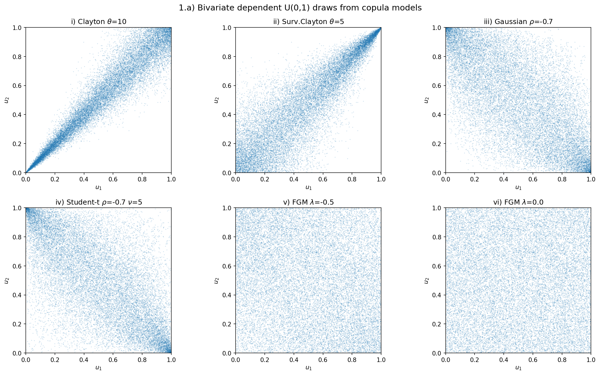
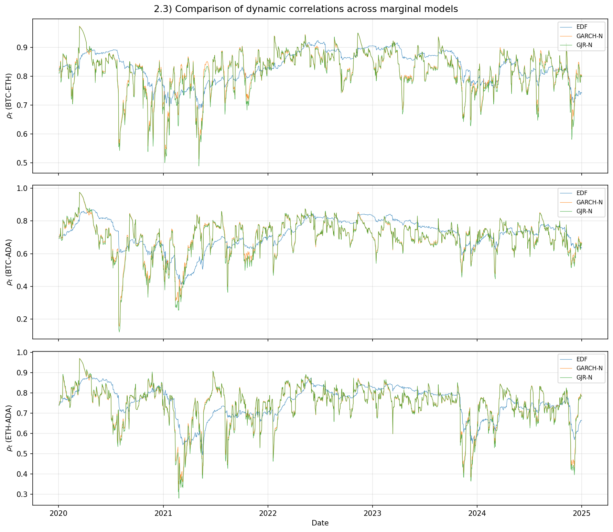
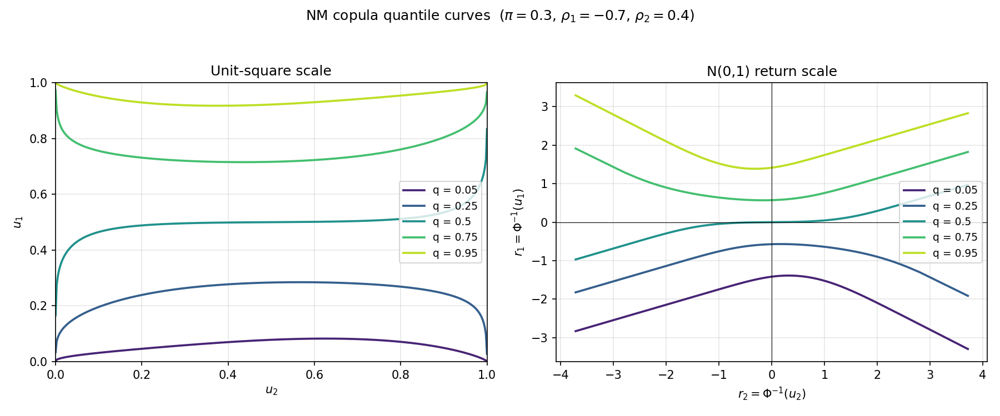
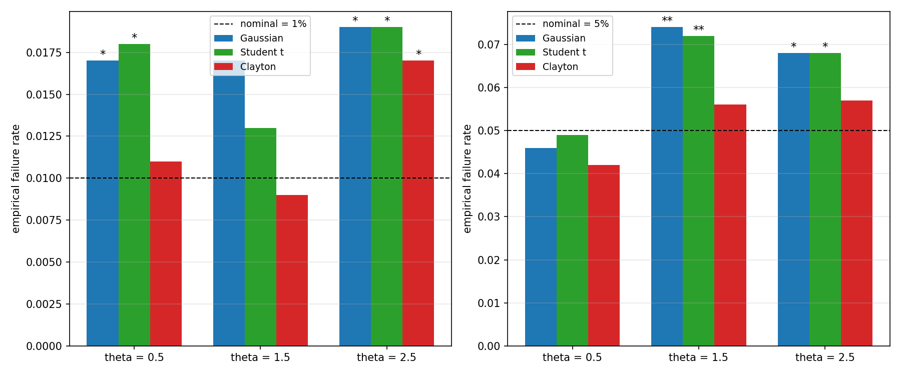
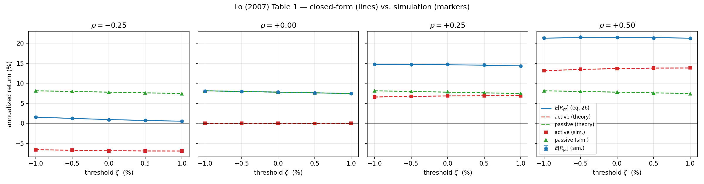

# Modeling Risk - Problem Set 2026

Python implementation of the 2026 Modeling Risk problem set. The repository
contains six exercise packages, a top-level orchestrator, generated figures, and
a LaTeX report whose tables and inline numbers are refreshed from Python output.

The older `readme.html` remains in the repository as an HTML reference. This
`README.md` is the GitHub-facing version.

## Requirements

- Python 3.10 or newer
- A TeX distribution with `pdflatex` if you want to build `report/main.pdf`
- Python packages listed in `requirements.txt`

Install the Python dependencies:

```bash
pip install -r requirements.txt
```

Current dependency file:

```text
numpy>=1.24
scipy>=1.10
matplotlib>=3.7
pandas>=2.0
openpyxl>=3.1
```

## Quick Start

Run every exercise and then compile the LaTeX report:

```bash
python main.py
```

Run only selected exercises:

```bash
python main.py --only 1 3 5
```

Run the Python exercises without rebuilding the PDF:

```bash
python main.py --skip-latex
```

Rebuild only the LaTeX report:

```bash
python main.py --skip-exercises
```

Run one exercise package directly:

```bash
python -m exercise1.main
python -m exercise2.main
python -m exercise3.main
python -m exercise4.main
python -m exercise5.main
python -m exercise6.main
```

All tunable parameters are centralized in `config.json`: copula parameters,
portfolio weights, Monte Carlo sizes, seeds, data paths, optimizer settings,
output directories, and report-generation paths.

## Project Structure

```text
PS2/
|-- config.json              # All tunable parameters
|-- requirements.txt         # Python dependencies
|-- README.md                # GitHub-facing project documentation
|-- readme.html              # Legacy HTML documentation
|-- changelog.md             # Version history
|-- main.py                  # Top-level driver: exercises + LaTeX report
|-- report_utils.py          # TexWriter and LaTeX number-format helpers
|-- crypto.xlsx              # BTC/ETH/ADA data for Exercise 2
|-- Homework_Problem_set_2026.pdf
|-- exercise1/
|   |-- copula_sim.py        # Copula simulators
|   |-- copula_likelihood.py # Gaussian and Student t copula likelihoods
|   |-- estimation.py        # EDF + IFM/CML estimation
|   |-- portfolio.py         # Return inversion and portfolio statistics
|   |-- plotting.py          # Exercise 1 figures
|   `-- main.py              # Runs parts 1.a-1.d
|-- exercise2/
|   |-- data.py              # Loads crypto.xlsx
|   |-- descriptive.py       # Summary moments and correlations
|   |-- garch.py             # GARCH(1,1) and GJR(1,1) MLE
|   |-- dcc.py               # Gaussian and Student t DCC models
|   |-- plotting.py          # Dynamic correlation figures
|   `-- main.py              # Runs parts 2.1-2.4
|-- exercise3/
|   |-- nm_copula.py         # Normal mixture copula CDF and quantile solver
|   |-- plotting.py          # Quantile-curve figures
|   `-- main.py              # Runs Exercise 3
|-- exercise4/
|   |-- black_scholes.py     # European call and put pricing
|   |-- copulas.py           # Return-scale Gaussian/t/Clayton shocks
|   |-- option_portfolio.py  # CC/PP payoff and return simulation
|   |-- stats.py             # Strike-grid moments
|   |-- plotting.py          # Option-portfolio figures
|   `-- main.py              # Runs parts 4.1-4.4
|-- exercise5/
|   |-- dgp.py               # Clayton DGP with N(0,1) margins
|   |-- estimation.py        # Gaussian/t/Clayton copula MLE
|   |-- var_forecast.py      # Empirical VaR from fitted copulas
|   |-- backtesting.py       # Kupiec unconditional-coverage test
|   |-- simulation.py        # Monte Carlo replication driver
|   |-- plotting.py          # Failure-rate plots
|   `-- main.py              # Runs Berger-style simulation
|-- exercise6/
|   |-- dgp.py               # Stationary AR(1) simulator
|   |-- policy.py            # Stop-loss switching rule
|   |-- theory.py            # Closed-form Lo equation (26)
|   |-- simulation.py        # Monte Carlo verification grid
|   |-- plotting.py          # Table-1 and sample-path figures
|   `-- main.py              # Runs Lo stop-loss verification
|-- figures/                 # Generated plots and text tables
`-- report/
    |-- main.tex             # Master LaTeX report
    |-- main.pdf             # Compiled report
    |-- generated/           # Python-generated LaTeX macros
    `-- sections/            # Exercise-specific report sections
```

## Report Architecture

The `report/` folder contains the written solution. The report is intentionally
not a static copy of console output. Each `exerciseN/main.py` writes
`report/generated/exN.tex` through `TexWriter` in `report_utils.py`.

The LaTeX section files then reference those generated macros. Re-running

```bash
python main.py
```

refreshes figures, table bodies, scalar estimates, and the final PDF. This
prevents numerical drift between the code and the written report.

To compile the report manually:

```bash
cd report
pdflatex main.tex
pdflatex main.tex
```

Two passes are used so references and the table of contents settle.

## Configuration Map

| Config key | Purpose |
| --- | --- |
| `simulation` | Exercise 1 draw counts, seeds, clipping epsilon |
| `copulas` | Clayton, survival Clayton, Gaussian, Student t, and FGM parameters |
| `marginals` | Exercise 1 portfolio marginal distributions |
| `marginals_1d` | Exercise 1.d mixture-copula marginal distributions |
| `portfolio` | Portfolio weights and VaR levels |
| `mixture` | Mixture probability and component copula parameters |
| `estimation` | EDF convention and optimizer settings |
| `output` | Figure output directory and DPI |
| `exercise2` | Crypto data path, asset names, GARCH/DCC optimizer settings |
| `exercise3` | Normal mixture copula parameters and quantile grid |
| `exercise4` | GBM, strike grid, copula scenarios, and seeds |
| `exercise5` | Berger simulation sizes, DGP theta values, weights, and parallelism |
| `exercise6` | Lo stop-loss parameters, AR(1) grid, simulation length, and seeds |

## Exercise 1 - Copula Simulation, Portfolio Analysis, and IFM Estimation

Exercise 1 simulates bivariate copulas, maps uniform draws into returns, builds a
two-asset portfolio, and estimates copula parameters by IFM/CML.

### Modules

| File | Role |
| --- | --- |
| `exercise1/copula_sim.py` | Simulates Clayton, survival Clayton, Gaussian, Student t, FGM, and mixture copulas by conditional inversion. |
| `exercise1/copula_likelihood.py` | Computes Gaussian and Student t copula log-likelihoods. |
| `exercise1/estimation.py` | Builds EDF pseudo-observations with rank/(T+1) and estimates copula parameters. |
| `exercise1/portfolio.py` | Converts uniforms to marginal returns and computes mean, volatility, skewness, kurtosis, and VaR. |
| `exercise1/plotting.py` | Generates scatter plots, portfolio histograms, and mixture-copula plots. |
| `exercise1/main.py` | Runs parts 1.a-1.d and emits LaTeX macros for the report. |

### Scenarios

| Part | What it does | Main outputs |
| --- | --- | --- |
| 1.a | Generates 100,000 dependent U(0,1) pairs for six copula models. | Dependence measures and `figures/fig_1a_scatter.png`. |
| 1.b | Transforms draws into returns with `R1 ~ N(0,1)` and `R2 ~ t(6)`, then forms `rp = 0.4 R1 + 0.6 R2`. | Portfolio moments, VaR, histograms, and cross-copula portfolio correlations. |
| 1.c | Treats Gaussian-copula simulated returns as data and estimates rho by EDF + Gaussian copula likelihood. | IFM/CML estimate of rho and log-likelihood. |
| 1.d | Simulates `0.6 Clayton(10) + 0.4 SurvivalClayton(5)` and estimates Gaussian and Student t copulas for comparison. | Mixture scatter, fitted parameters, and likelihood comparison. |

Example:

```python
import numpy as np
from exercise1.copula_sim import sim_gaussian

rng = np.random.default_rng(42)
v1 = rng.random(10_000)
v2 = rng.random(10_000)
u1, u2 = sim_gaussian(v1, v2, rho=-0.7)
```

Run:

```bash
python -m exercise1.main
```

## Exercise 2 - DCC Copula Models on Crypto Returns

Exercise 2 estimates dynamic dependence among BTC, ETH, and ADA returns using
DCC models under several marginal specifications.

### Modules

| File | Role |
| --- | --- |
| `exercise2/data.py` | Reads `crypto.xlsx`, extracts daily returns, and drops the initial missing return. |
| `exercise2/descriptive.py` | Computes mean, standard deviation, skewness, kurtosis, and sample correlations. |
| `exercise2/garch.py` | Estimates GARCH(1,1) and GJR(1,1) volatility models by maximum likelihood. |
| `exercise2/dcc.py` | Estimates Gaussian DCC and Student t DCC copula models. |
| `exercise2/plotting.py` | Draws dynamic pairwise correlation paths and model comparisons. |
| `exercise2/main.py` | Runs parts 2.1-2.4 and writes report macros. |

### Scenarios

| Part | What it does | Main outputs |
| --- | --- | --- |
| 2.1 | Computes descriptive statistics for BTC, ETH, and ADA returns. | Moment table and sample correlation matrix. |
| 2.2a | Uses EDF marginals and estimates Gaussian DCC. | Dynamic correlations from nonparametric pseudo-observations. |
| 2.2b | Fits GARCH(1,1) margins before Gaussian DCC. | DCC estimates after volatility standardization. |
| 2.2c | Fits GJR(1,1) margins before Gaussian DCC. | DCC estimates with asymmetric volatility response. |
| 2.3 | Compares the dynamic correlation paths across marginal choices. | `figures/fig_2_3_comparison.png`. |
| 2.4 | Estimates DCC under a Student t copula with EDF margins. | Tail-sensitive DCC estimates and likelihood comparison. |

Example:

```python
from exercise2.data import load_crypto_returns
from exercise2.descriptive import descriptive_stats

returns = load_crypto_returns("crypto.xlsx", ["BTC", "ETH", "ADA"])
stats, corr = descriptive_stats(returns)
```

Run:

```bash
python -m exercise2.main
```

## Exercise 3 - Normal Mixture Copula q-Quantile Curves

Exercise 3 computes q-quantile curves for a bivariate normal mixture copula.
The conditional CDF is a weighted mixture of Gaussian conditional CDFs, so the
inverse in `u1` is solved numerically rather than by a closed form.

### Modules

| File | Role |
| --- | --- |
| `exercise3/nm_copula.py` | Evaluates the normal mixture conditional CDF and solves quantile roots with Brent's method. |
| `exercise3/plotting.py` | Plots quantile curves in the unit square and in N(0,1) return space. |
| `exercise3/main.py` | Reads the Exercise 3 config, computes curves, checks solved roots, and writes report macros. |

### Scenario

| Setting | Value |
| --- | --- |
| Mixture weight | `pi = 0.3` |
| Component correlations | `rho1 = -0.7`, `rho2 = 0.4` |
| Quantile levels | `0.05`, `0.25`, `0.50`, `0.75`, `0.95` |
| Grid size | `401` points on `(eps, 1 - eps)` |

Main output:

```text
figures/fig_3_nm_quantile_curves.png
```

Example:

```python
import numpy as np
from exercise3.nm_copula import nm_quantile_curve

u2_grid = np.linspace(1e-4, 1 - 1e-4, 401)
curve = nm_quantile_curve(u2_grid, q=0.05, pi=0.3, rho1=-0.7, rho2=0.4)
```

Run:

```bash
python -m exercise3.main
```

## Exercise 4 - Option-Based Portfolios under Alternative Copulas

Exercise 4 simulates option-based portfolios under different dependence
structures. The asset marginals are generated from the same GBM setup; the
copula changes the cross-asset dependence.

### Modules

| File | Role |
| --- | --- |
| `exercise4/black_scholes.py` | Prices European calls and puts over the strike grid. |
| `exercise4/copulas.py` | Generates bivariate Gaussian, Student t, and Clayton shocks with N(0,1) margins. |
| `exercise4/option_portfolio.py` | Computes call-plus-stock and put-plus-stock portfolio returns. |
| `exercise4/stats.py` | Computes mean, volatility, skewness, and kurtosis by strike. |
| `exercise4/plotting.py` | Plots the four portfolio statistics against strike. |
| `exercise4/main.py` | Runs the four copula scenarios and writes report macros. |

### Scenarios

| Part | Scenario | Main interpretation |
| --- | --- | --- |
| 4.1 | Gaussian copula, `rho = 0.9` | Strong positive dependence; cross-asset option legs closely track same-asset portfolios. |
| 4.2 | Gaussian copula, `rho = 0.3` | Weaker linear dependence; cross-asset option portfolios become more volatile. |
| 4.3 | Student t copula, `rho = 0.3`, `nu = 5` | Same linear correlation as 4.2 but heavier joint tails. |
| 4.4 | Clayton copula, `theta = 10` | Strong lower-tail dependence; downside co-movement is concentrated in the lower tail. |

Main outputs:

```text
figures/fig_4_4_1_gaussian_high.png
figures/fig_4_4_2_gaussian_low.png
figures/fig_4_4_3_student_t.png
figures/fig_4_4_4_clayton.png
```

Example:

```python
from exercise4.black_scholes import bs_call_put

calls, puts = bs_call_put(S0=100, r=0.03, sigma=0.2, T=1, K=[95, 100, 105])
```

Run:

```bash
python -m exercise4.main
```

## Exercise 5 - Berger (2016) Simulation Study

Exercise 5 reproduces the qualitative structure of Berger (2016), Section 3.1,
under the project restriction that the DGP is a bivariate Clayton copula with
N(0,1) marginals. Candidate Gaussian, Student t, and Clayton copulas are fitted
and then evaluated through VaR backtesting.

### Modules

| File | Role |
| --- | --- |
| `exercise5/dgp.py` | Simulates Clayton-copula observations with N(0,1) marginals. |
| `exercise5/estimation.py` | Estimates Gaussian, Student t, and Clayton copulas by MLE with fixed margins. |
| `exercise5/var_forecast.py` | Draws from fitted copulas and computes empirical portfolio VaR. |
| `exercise5/backtesting.py` | Implements the Kupiec unconditional-coverage LR test. |
| `exercise5/simulation.py` | Runs the replication loop and aggregates breach counts. |
| `exercise5/plotting.py` | Plots empirical failure rates and rejection markers. |
| `exercise5/main.py` | Runs all theta scenarios and writes tables/figures/report macros. |

### Scenarios

| Parameter | Value |
| --- | --- |
| True DGP | Clayton copula |
| `theta` values | `0.5`, `1.5`, `2.5` |
| Margins | `N(0,1)` for both assets |
| Portfolio | Equal weights `[0.5, 0.5]` |
| In-sample observations | `1000` |
| Out-of-sample observation | `1` per replication |
| Inner VaR simulation | `10,000` draws |
| Default replications | `1,000` per theta |

The code exposes `n_rep` in `config.json`. Berger uses 10,000 replications; this
project defaults to 1,000 for runtime.

Main outputs:

```text
figures/tab_5_failure_rates.txt
figures/fig_5_failure_rates.png
```

Example:

```python
from exercise5.backtesting import kupiec_uc

result = kupiec_uc(n_breaches=57, n_forecasts=1000, p=0.05)
```

Run:

```bash
python -m exercise5.main
```

## Exercise 6 - Lo (2007) Stop-Loss Policy

Exercise 6 verifies equation (26) from Lo (2007), "Where Do Alphas Come From? A
Measure of the Value of Active Investment Management." The code compares the
closed-form active/passive decomposition with a Monte Carlo simulation of a
stop-loss policy applied to a stationary AR(1) return process.

### Modules

| File | Role |
| --- | --- |
| `exercise6/dgp.py` | Simulates the AR(1) process from the stationary distribution. |
| `exercise6/policy.py` | Applies the stop-loss rule and aligns lagged weights with returns. |
| `exercise6/theory.py` | Evaluates Lo's closed-form expected return and active/passive components. |
| `exercise6/simulation.py` | Runs the `(rho, zeta)` grid and computes Monte Carlo standard errors. |
| `exercise6/plotting.py` | Plots Table-1-style curves and an illustrative sample path. |
| `exercise6/main.py` | Runs the full verification and writes report macros. |

### Scenarios

| Parameter | Value |
| --- | --- |
| Annual risk-free rate | `5%` |
| Annual mean return | `10%` |
| Annual volatility | `20%` |
| Frequency | Monthly, `12` periods per year |
| `rho` grid | `-0.25`, `0.00`, `0.25`, `0.50` |
| `zeta` grid | `-1%`, `-0.5%`, `0%`, `0.5%`, `1%` |
| Simulation length | `2,000,000` observations per grid cell |

Main outputs:

```text
figures/tab_6_table1.txt
figures/fig_6_table1.png
figures/fig_6_sample_path.png
report/generated/ex6.tex
```

Example:

```python
from exercise6.theory import expected_return_closed_form

result = expected_return_closed_form(
    mu=0.10 / 12,
    rho=0.25,
    sigma=0.20 / (12 ** 0.5),
    zeta=0.0,
    R_f=0.05 / 12,
)
```

Run:

```bash
python -m exercise6.main
```

## Generated Outputs

The repository writes results to:

| Path | Contents |
| --- | --- |
| `figures/*.png` | Exercise figures used by the report. |
| `figures/tab_5_failure_rates.txt` | Exercise 5 failure-rate and fitted-parameter table. |
| `figures/tab_6_table1.txt` | Exercise 6 closed-form and simulated table dump. |
| `report/generated/ex1.tex` through `ex6.tex` | LaTeX macros generated from Python results. |
| `report/main.pdf` | Final compiled report. |

Representative figures include:











## Development Notes

- The code is organized by exercise so each mathematical task has a narrow
  module boundary.
- `main.py` imports each `exerciseN.main` package and calls its `main()`
  function. It keeps going after a failed stage, then exits with code `1` if
  any stage failed.
- `report_utils.py` is shared infrastructure, not exercise logic. It handles
  numeric formatting and atomic LaTeX macro writes.
- The figures directory is an output target. Re-running exercises may overwrite
  generated plots and text tables.
- The LaTeX report consumes generated macros, so report numbers should be
  regenerated through Python rather than manually edited in `.tex` files.
